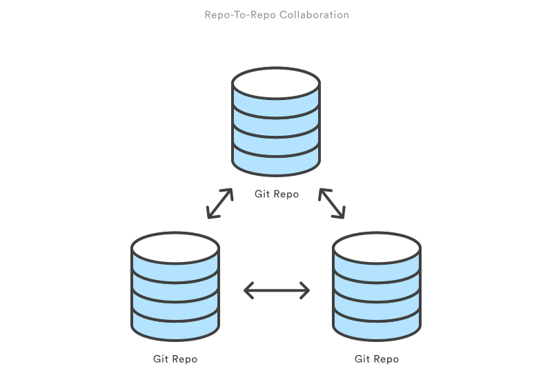

<!-- $theme: gaia -->
###### Unit 1

VCS, Git & GitHub
===

# 

###### [@kabirbaidhya](https://github.com/kabirbaidhya)

---
---
<!--
$theme: gaia
template: gaia-->
# Version Control
---
<!--
$theme: gaia
template: default-->
# What is VCS?
---
> Version control systems are a category of software tools that help a software team manage changes to source code over time.
 <small>https://www.atlassian.com/git/tutorials/what-is-version-control</small>


---
### Why Version Control?
1. Collaboration
2. Track complete change history
3. Branching and Merging
4. Versions
5. Revert/Rollback

---
### Distributed Version Control Systems
 * Code is hosted in a repository
 * Every client has a complete copy of the repository
 * Synchronize the changes in between client & server
 * Every clone is really a full backup of the repository
 * Example: Git, Mercurial, etc.
---
### Distributed Version Control Systems
# 
---
# Git
---
# What is Git?
---
#### A Distributed Version Control System (VCS).
---
###### More precisely,
##### The most popular & widely used modern version control system today.
---
###### Originally developed by 
##### Linus Torvalds
###### the creator of the Linux kernel.
---
# What's the big deal about Git?
---
## Easy to learn
---
## Powerful
---
## Performance
---
## Flexible
---
## Open Source
---
## And it's a de facto standard
---
# Getting Started with Git
---
### Installation
##### Linux

###### Ubuntu/Debain
```bash
$ sudo apt-get install git
```

###### Centos/RHEL/Fedora

```bash
$ sudo yum install git
```

<small>For other distros check the official installation docs.</small>

---
### Installation
##### Windows

1. Download the installer from 
   https://git-for-windows.github.io/
2. Install Git

---
### Check Installation
Veriy that git is proplery installed with

```bash
$ git --version
```
It should print the git version installed on your system like this.
```plain
git version 2.7.4
```

---
# Configuration
---
### Configure git user
<small>The first thing you do after installing git is to set up your user name and email.</small>
```bash
$ git config --global user.name <name>
$ git config --global user.email <email>
```
<small>Then you can check your config with</small>
```bash
$ git config --list

user.name=Kabir Baidhya
user.email=kabirbaidhya@gmail.com
core.editor=vim
core.excludesfile=/home/kabir/.gitignore_global
```
---
# Setting up a repository
---
### Initialize
The `git init` command creates a new Git repository.

```bash
# Go to your project directory
$ cd /your/project/directory

# Initialize a git repository
$ git init
```
---
### Clone

The `git clone` command clones a remote repository into the local machine.

This will create a complete copy of remotely hosted repository in your local computer.
```bash
$ git clone <repo url> [directory]
```
---
# Saving Changes
---
### Adding files
In order to save your changes to the repository you'll need to `commit` your changes.

You first need to select files you want to commit using this `git add` command.
```bash
# Add specific file(s)
$ git add <file(s)...>

# Add whole path or directory
$ git add <path>

# Add all of your changes
$ git add --all
```
---
### Committing changes
The git commit command commits the staged changes to the history.

```
$ git commit
```
<small>This will ask you to enter a commit message for your commit. </small>

<small>In case you don't like to be prompted for the message, you can set directly using the `-m` option like this</small>
```
$ git commit -m "This was my first commit"
```
---
# Inspecting the repository
---
### Checking status
We use `git status` command to display the status of the working directory and the staging area. 

```bash
$ git status 
```
<small>If you have nothing to be committed or no untracked files then it would just show some message like this</small>
```bash
$ git status
On branch master
nothing to commit, working directory clean
```
<small>But if you have some changes to be committed it lists them.</small>

---
### History
We can use the `git log` command to display the history of committed changes on the repository.

```bash
$ git log
```
<small>There are lots of options available for better inspection of history. For instance,</small>
```bash
$ git log --oneline # Shows each commit on one line
$ git log -n <limit>
$ git log --author="<pattern>"
$ git log <since>..<until>
```
---
# Working with remote
---
### Adding a remote
You need to add remote repository urls of a remote server to be able to synhronize your changes with the remote repository. 
You can do this using the `git remote add` command.

```bash
$ git remote add <name> <remote url>
```
<small>You can verify added remotes by doing</small>
```bash
$ git remote -v
```
<small>It should list the urls to the remote repositories you've added so far.</small>

---
### Pushing your changes
Push all the changes (commits) you did to your local repository to the remote repositories is pretty simple with `git push` command.

```bash
# Push a local branch changes to remote
$ git push <remote> <branch>

# Push all the changes of local branches to remote
$ git push <remote> --all
```
<small>For instance:</small>
```bash
$ git push origin master
```
---
### Pulling remote changes
The `git pull` command fetches the changes of the current branch from remote and merges it into the local branch.

This is same as running the combination of `git fetch` and then `git merge`.

```bash
$ git pull <remote> [branch]
```
<small>Example:</small>
```bash
$ git pull origin master
```

---
# Checking out code
---
### Checking out
Checking out code actually means to take your working directory to a specific change (commit), branch, tag or or even different versions of files.

You can do all these things with just a simple command `git checkout`.

```bash
$ git checkout <commit>         # go to that commit
$ git checkout <commit> <file>  # checkout that file to previous version
$ git checkout <branch>         # go to another branch
$ git checkout <tag>            # go to a tagged version of the repository
```

---
# Branching & Merging
---
### Branching
The `git branch` command allows you to list, create and delete branches.

To create a new branch you can do
```bash
$ git branch <new-branch-name>
```

---
### Merging
You can use `git merge` command to merge changes of a branch into the current `HEAD`. 

Merging a branch into your current branch is as simple as:
```bash
$ git merge <branch>
```
---
# GitHub
---
### GitHub
 - Software development platform
 - Sort of Social networking platform for developers
 - Provides Git repository hosting services & web based platform to manage repositories and projects
 - Popular for open source projects
---
# Read More?
---
### Links
1. https://git-scm.com/book/en/v2
2. https://www.atlassian.com/git/tutorials/what-is-version-control
3. https://try.github.io
4. https://www.git-tower.com/blog/git-cheat-sheet/
---
<!--
$theme: gaia
template: gaia-->
# Thank You
###### [@kabirbaidhya](https://github.com/kabirbaidhya)
###### kabirbaidhya@gmail.com
<!--footer: The slides were created using Marp. https://yhatt.github.io/marp/ -->
